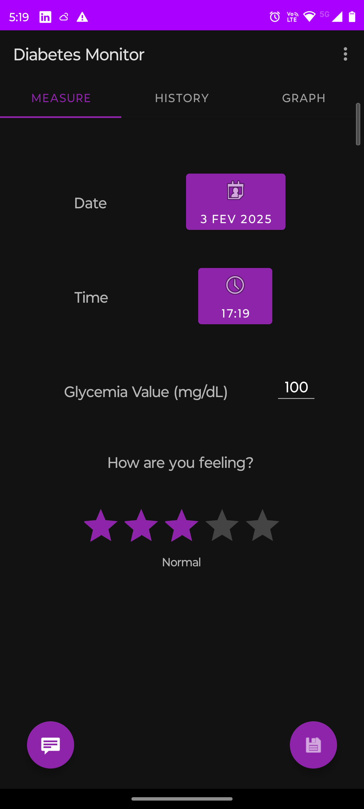
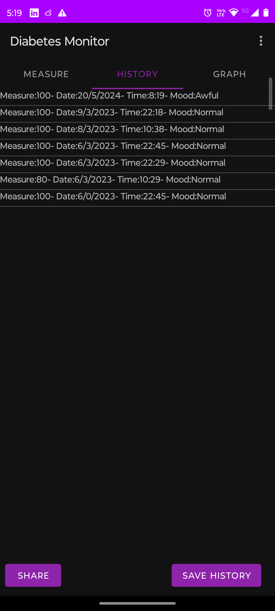
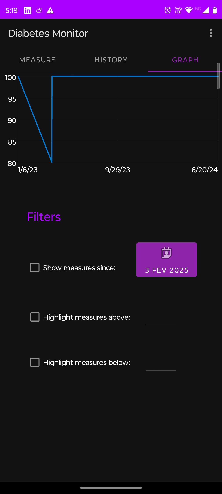
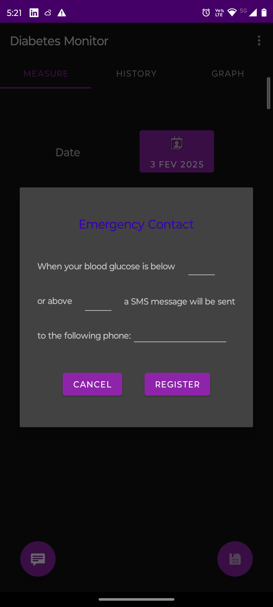
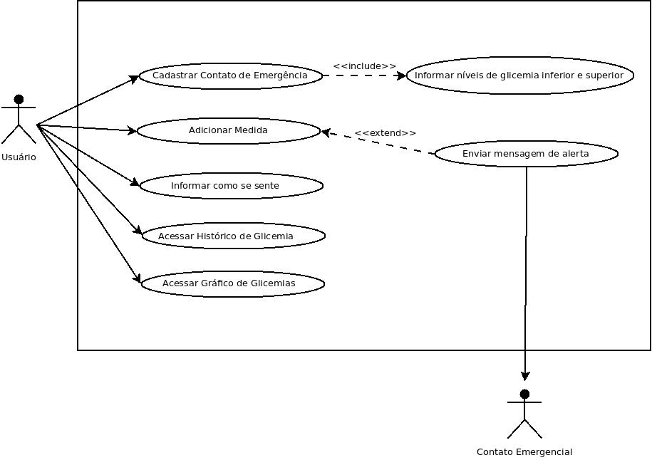
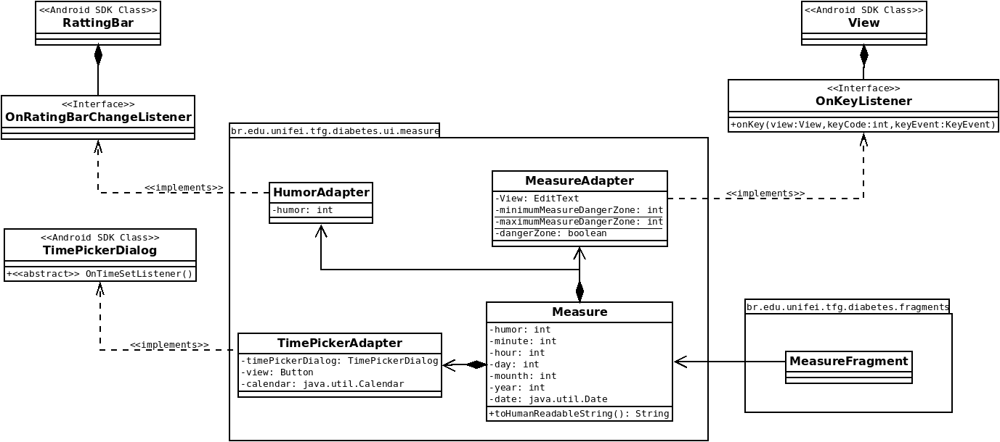
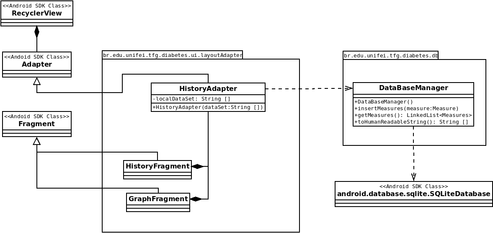
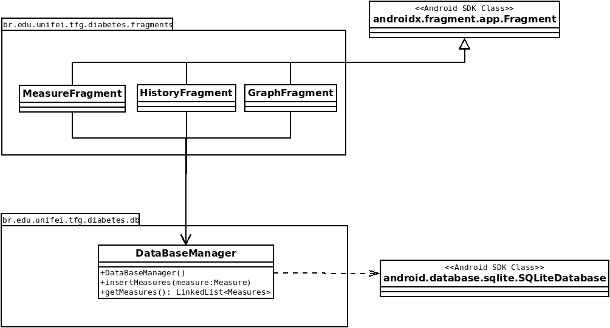
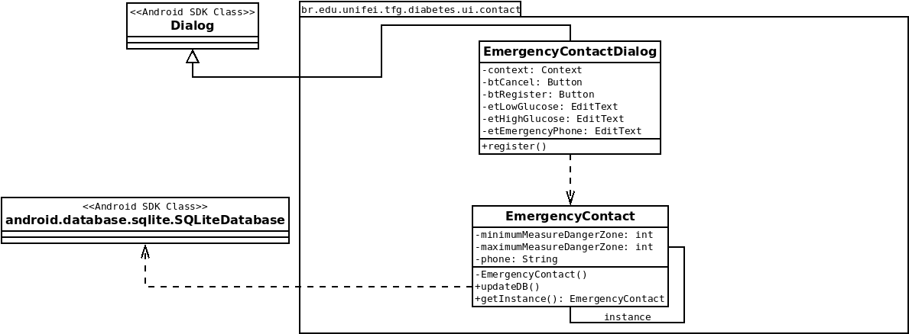

# Diabetes Monitor

Este aplicativo tem como objetivo ajudar pessoas com diabetes a monitorar seu índice glicêmico e alertar um contato em caso de necessidade.

## Screenshots

## Casos de uso

## Diagramas UML

## O que está atualmente implementado e funcionando:

- Armazenar uma medição  
- Acessar o histórico de medições  
- Um gráfico é plotado com as medições  
- Adicionar um número de telefone de contato que receberá uma mensagem em caso de medições anormais  
- Suporte para dois idiomas: português e inglês  
- Salvamento do histórico em um arquivo de texto  

## O que gostaria de implementar no futuro:

- Carregar o histórico a partir de um arquivo de texto  
- Criar um arquivo PDF com o histórico  
- Compartilhar o histórico com outros aplicativos (Google Drive, WhatsApp, Mensagens)  
- Filtrar algumas medições por data  
- Destacar medições acima e abaixo de um valor específico  
- Usar outros meios para alertar o contato de emergência, como WhatsApp ou e-mail  
- Adicionar e gerenciar mais de um contato de emergência (adicionar, excluir e editar contatos)  
- Ler e armazenar automaticamente a medição de glicose a partir de um medidor de glicose Bluetooth

# English translation

This App aims to help people who have diabetes track their glycemic index and alert a contact in case of need.

## What is currently implemented and working:

* Store a measure
* Access the measure history
* A graph is ploted with the measures
* Add a contact phone that will receive a message in case of anormal measures
* Support to two languages: portuguese and english 
* Saving the history via a text file

## What we want to implement in the future:

* loading the history via a text file
* Create a pdf file with the history
* Share the history with other apps (Google Drive, Whatsapp, Messages)
* Filter some measures by date
* Highligh measures above and below a especific value
* Use other means to alert the emergency contact like Whatsapp or Email
* Add and menage more than one emergency contact. (Add, delete and edit the emergency contacts)
* Automatically read and store the blood sugar measure from a Bluetooth blood glucose meter
